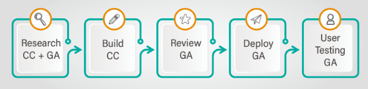

# Content Creation Philosophy at GreyAtom

## GreyAtom's Perspective on Online Learning
Learning on MOOCs often leaves the learners disengaged. We have spoken to thousands of aspiring learners who have tried acquiring career pivoting skills in emerging tech on MOOCs and have been unable to keep themselves motivated. The average completion rates on MOOCs are quite low (around 15% approximately). Most MOOC platforms still feel like claustrophobic lecture halls instead of intimate Meetup sessions. The majority of online learning environments are no more than video content containers with quizzes and a discussion forum. These default features force online instructors to use a style of teaching that feels more like shouting to the masses than engaging in meaningful conversations. This presented a challenge and an opportunity: How can we design online learning environments that achieve scale and intimacy? How do we make digital platforms feel as inviting as well-designed physical classrooms?

At GreyAtom, we first started with building career focussed learning programs from ground up and ran them in a classroom format for 18 months , where 50% of the time was spent on instruction and 50 % on hands on activities on our coding platform - GLabs. We weaved in mentor led hackathons  as part of the program and saw outcomes go significantly higher when there was high peer collaboration and mentor intervention. 70% of our learners were able to pivot their careers with our programs.

This gave us a lot of insight into how people learn best and we are now using these insights to move towards an online learning model that delivers the holy trinity of Quality, Scale and Personalization in education. Here is how we are doing it! Our answer is the Flipped MOOC model - blending traditional learning with constant peer interactions and regular mentor interventions.   

### Learning with a Tribe

People learn with small tribe of their own - a small group of equally motivated learners. We strike the hard balance between large-group instruction and give people smaller chambers of interaction for on-boarding applied sciences. Peer learning is highly encouraged with the first channel of help always being routed to the peers. 

Research also indicates that peer learning activities typically yield very good results for both mentor and mentee: team-building spirit and more supportive relationships; greater psychological well-being, social competence, communication skills and self-esteem; and higher achievement and greater productivity in terms of enhanced learning outcomes. Reference: [How Peer Teaching Improves Student Learning and 10 Ways To Encourage It](https://www.opencolleges.edu.au/informed/features/peer-teaching/)

Moreover self-learning requires quite a bit of discipline and can be frustrating at times especially when stuck. Thus, having a good support system in the form of peers and a mentor helps to stay on track while learning. 

### Interventions with Tribe Leader - Mentor

Mentorship has been known to be effective in bridging the knowledge gap and understanding the use of emerging technologies for business. An ideal mentor would be someone who has a working knowledge of emerging technologies and has actually solved business problems using them. These mentors are best placed to guide aspiring learners on the path to upskilling into niche emerging technologies. Mentors hold learners accountable for their learning goals, help learners grow and share practical knowledge that they have accumulated over years of practice. They also advice the learners on how to build their portfolio such that they stand out from the rest of the crowd. Our data says that mentorship improves learning outcomes by almost 5 times! 

With the flipped model, learners come prepared with the content to the sessions, and the learning that happens in those sessions is a level up from traditional learning. With a lot of focus on problem solving instead of just onboarding, learners accumulate skills that actually help them in their professional careers. 

### Learn by Doing - work on real problems

Our inhouse personalized AI powered learning platform - Glabs enables learners to apply what they have learnt by doing hands-on exercises. They will also see their skills grow with personalized skill maps that compare with the recommended baselines giving them actionable insights on what to learn next. 

Since in industry everyone participates in solving problems as a team, we highly encourage team participation through selected hackathons and projects within the platform. With the weekly progress and a host of learner analytics available to the mentor, the mentor exactly knows the prescriptive learning advice to provide to the mentee.  

This is GreyAtom's model for upskilling learners in emerging technologies and it is for these learners that content will be created by global experts. So with the brief overview of GreyAtom's perspective on online education. Let's now dive into the basic principles of instructional design to keep in mind while building self-paced content for the learners. 

# Content Curation Process
The content building process can be broken up into the following phases 

CC corresponds to the content creator while GA corresponds to GreyAtom. Let’s look at each of the phases in detail.

## 1. Research
Before you get into the details of creating your concept, take some time (30 minutes or so) to think about the following areas and write down your answers. Use those answers to guide the rest of your planning and content creation; they can save you a lot of time in the end.

- Define the problem statement and the high-level goal of the concept 
- Identify your audience.
- What do you think should have already been covered before? Do you have any dependencies with other concepts in terms of what you want to onboard?
- Define the course learning objectives.

Eventually, you will spend much more than 30 minutes planning and thinking about each of these areas. But the areas are not independent of each other. For right now, the idea is to think about all of the major areas once, briefly and at a high level, so that when you get into the details for each area, you have the start of a global plan in place.

Some of the good practices while researching for a concept
- Look at other tutorials/blogs which cover the concept and understand what do they do well and what they don’t. 
- Make a note of what is done well and try to do more of that. 
- Also, make a note of what is not done well and try to avoid the same or rectify in the concept that you are about to build. 

## 2. Build an outline - Concept Tree

The first step before building out the content is building out a complete outline of what you wish to cover and a hierarchical breakup. 
- List the key topics to be onboarded with this concept and the criticality of each one. 
- Define the problem you want learners to solve as part of this course, mention in your comments, why this problem is best suited for the concept
- Review the concept outline with the GreyAtom Program team and freeze the outline. This is an important checkpoint for both the creator and GreyAtom to be on the same page w.r.t the content that needs to be made. 

For each concept, the chapters along with topics in each chapter and whether the topics contain hands-on tasks or not. Initially, you might not have an idea of the exact tasks to be placed. But a high level idea of where to put the tasks is a good place to start and iteratively you can build them out. 

## 3. Review
**Internal GA review**

GA would provide the feedback via bitbucket issues. 
For every feedback regarding the content, the GA team will create a bitbucket issue. Once the feedback is incorporated, the content creator can mark the issue as resolved along with an acknowledgement that the feedback is locked in.

In case, the content creator feels that the feedback cannot be incorporated, the content creator can comment on the issue - why the feedback won’t be incorporated.

**External Expert review**

Post the feedback incorporation of GA, the concept will then be sent to an external expert who is outside the content creation process to get an impartial view of the content.
The expert also locks in the review via bitbucket issues and the resolution process is the same as with the content team.
## 4. Deploy
 GA team will deploy the content into platform and share access with you, so that you can look at how the content looks in end state.

## 5. Beta Test

Even after all the reviews, the real feedback for content comes from beta testing. Early user testing has given us some fantastic feedback . We will open up the content to 25 learners who will consume it before the course becomes globally live and share the feedback. 

# Curating Content - The complete journey
We will discuss how to actually curate the content for GreyAtom. These procedures are distilled from the best practices and success we have seen from earlier programs.  

## Content Hierarchy

Before you start curating the content, it is important to understand the content hierarchy. The hierarchy of content as defined from the top to bottom is as follows:

Program ->Sprint -> Concept -> Learning Units

## Program

A program is top most element of the content hierarchy. A program typically lasts 4-6 months depending on the modules that are defined within the module. 
Ex: Data Science Master Program

## Sprint

The next logical entity in the program. A sprint contains a set of concepts that together make up an important component of the program. A sprint is planned for a period of two weeks with a estimated time to be spent as 16hours. A sprint consists of learning units and projects. 

## Concept/Course

At the end of learning a particular concept, the learner should to acquire a tangible skill which is demonstrable. Example: Foundations of JavaScript. Each concept should ideally consisy of following learning units.

### Concept Onbaording
It primarily consists list of select resources (3 at the most) that are required to be completed by the learner to have understanding of the concept.

### Tutorial
These are one or two tutorials which are building upon the onboarded concept.

### Self paced code exercises
These are small coding assignment / challenges in form of embeddable code pane which a learner has to complete is order to have hands-on experience of topics learnt. 

### Project
This forms the part of assessmet for this concept. A learner has to apply all the topics learnt in this concept and all the concepts prior to this in order to complete this project.

### Any additional references
Curated list of additional references a learne can go through to dive deep into the concept. This would also include link to official documentations.

### Checklist of items
This is a checklist of items that a learner has to finish for completing the sprint successfully.

### Other interesting projects on GitHub
Curated list of relevant projects of GitHub / Blogs which a learner can refer to.

### Assessment Quiz
This is an end of concept assessment in form a multi choice question quiz of upto 10 questions.

## Sprint End Project
A learner has to complete a project at the end of every sprint as part of the assessment. The project consists of following elements

### Learning pre-requisites
This is a checklist of the essentials topics a learner must have completed in order to attempt this project.

### Project overview
This is a high level overview of the project describing the details of the web page / app that the learner has to build.

### Screen mock ups
Mockups of the screens required for the project.

### Boiler plate
This is a repository of boilerplate code that can be provided to the learners that would help them in getting a headstart in the project.

### Assets
Any assets in form of fonts, images,etc required for the project. Assets will be part of the boiler plate repository. 

### User stories
Break down the project into small units of work. User stories are generally written in non technical language detailing out the functionality that the story would add to the larger project.

