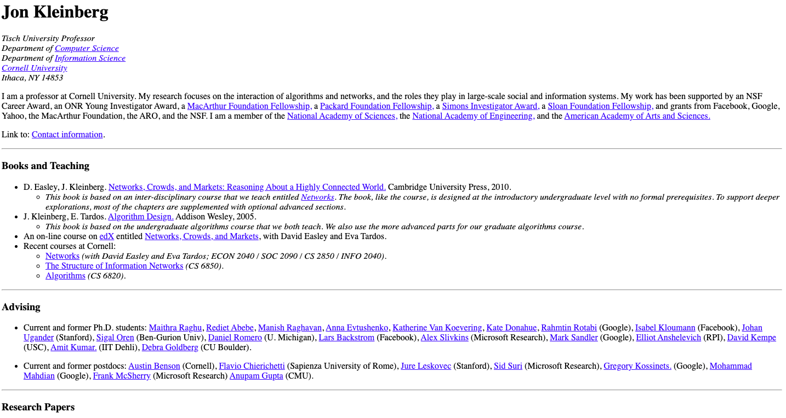

## Concept 1: HTML Foundations

### Introduction
HTML is the markup that contains all the actual stuff that a web page has. All the text on this page you're reading right now lives inside HTML tags that tell your browser how to order the content on the page. Go on, right click any element on the page and choose "Inspect Element" to open up your browser's Developer Tools and it will show you the structure of the page.

### Learning Objectives
To consider yourself having learnt and applied HTML these are the basic questions you should have the answers to. If you don't have the answers to these questions, then revisit the material. 

Must Know
* How is an HTML5 document structured?
* What are elements/tags?
* What are element attributes?
* How do you link to external files?
* When should you use IDs vs Classes?
* What attributes are required by image and links for them to be effective and accessible?
* Where should your CSS live?

### What you will be able to build?
As defined in the sprints objective, you will be building a personal profile page resembling the following mockup at the end of this sprint. 

However, after completing this concept you will be able to build a basic HTML page which will be the first step towards the larger project. The basic HTML page would look something like follows

### What you must do

- Do the [Codecademy HTML course](https://www.codecademy.com/learn/learn-html) (only the free stuff) for a healthy baseline understanding of HTML.  Keep track of the most commonly used elements in HTML. [Estimated Time: 4hrs]

- Once you have gone through the above course, do this small assignment on CodePen. This assignment will take you 10 minutes to complete. If you are unable to do this assignment, then go back to the resource and revise your concepts. [Estimated Time: 30mins]. [CodePen Assignment](https://codepen.io/lambdaschool/pen/RyVowM/)

- Next have a look at all the different elements of HTML that make up your general webpage. The best reference is MDN documentation. Have a look [here](https://developer.mozilla.org/en-US/docs/Web/HTML/Element#Content_sectioning) [Estimated Time: 6hrs]

- Still have some questions on HTML. Refer to the first two lessons of [Shay Howe's HTML tutorial](https://learn.shayhowe.com/html-css/building-your-first-web-page/). [Estimated Time: 4 hrs]   

### Additional Learning
This section contains helpful links to other content. It isn't required, so consider it supplemental for if you need to dive deeper into something.

* [W3 Schools' Elements of HTML](https://www.w3schools.com/html/html_elements.asp)
* [OverAPI's HTML Cheat Sheet](http://overapi.com/html)

More Practise Code Pens: https://codepen.io/zuraizm/pen/vGDHl/

### Knowledge Check - Quiz

1. Choose the correct HTML element for the largest heading:
  - `<head>`
  - `<h1>`
  - `<body>`

2. Choose the correct HTML syntax for adding emphasis on a segment of text
  - `
This is <em>Correct</em>
`
  - `
This is <em>Correct
</em>`
  - `
This is <b>Correct</b>
`

3. Which of the following tags is used to hyperlink the content on web page
  - `<href>`
  - `<a>`
  - `<url>`

### Project Tasks

Objective: Build the personal profile page from scratch.

- User Story #1: My portfolio should have a welcome section with an id of welcome-section.
- User Story #2: The welcome section should have an h1element that contains text.
- User Story #3: My portfolio should have a projects section with an id of projects.
- User Story #4: The projects section should contain at least one element with a class of project-tileto hold a project.
- User Story #5: The projects section should contain at least one link to a project.

